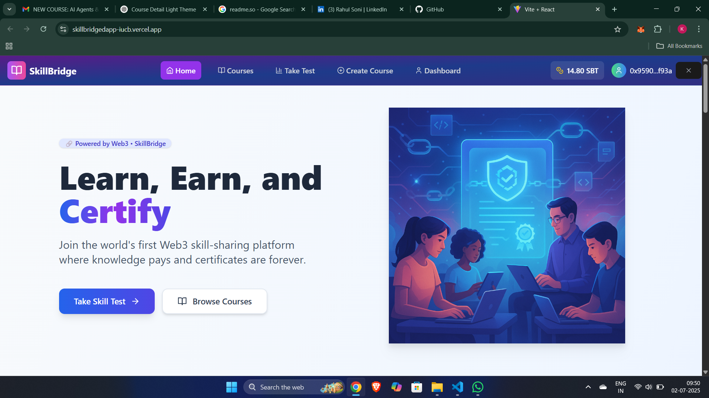

# 🧠 SkillBridge – Learn, Earn & Certify on Web3


> **SkillBridge** is a decentralized learning platform that connects skilled instructors with eager learners. Earn tokens by passing skill-based tests, enroll in Web3-powered courses, and mint your own NFT certificates – all backed by smart contracts and IPFS.

---

## 🌐 Live Demo

- 🌍 Frontend: [https://skillbridgedapp-iucb.vercel.app](https://skillbridgedapp-iucb.vercel.app)
- 🛠️ Backend API: [https://skillbridgedapp.onrender.com](https://skillbridgedapp.onrender.com)

---

## 📚 Overview

SkillBridge enables:

- 🧪 Skill tests to earn tokens  
- 🎓 Enrolling in token-gated courses  
- 🤖 AI-powered course assistants  
- 🏆 NFT certificates on completion  
- 🗂 IPFS storage for course metadata  
- 🔐 Web3 smart contracts for transparency and security

Built with a focus on ownership, decentralization, and learner incentives, SkillBridge redefines how online education works.

---

## ⚙️ Tech Stack

| Layer        | Technologies Used                                   |
|--------------|------------------------------------------------------|
| Frontend     | React, Vite, TailwindCSS, React Router              |
| Backend      | Node.js, Express, Multer, Pinata SDK, OpenAI        |
| AI Layer     | OpenAI API, ChromaDB vector database                |
| Blockchain   | Solidity, Hardhat, Ethers.js                        |
| Storage      | IPFS via Pinata                                     |
| Wallet       | MetaMask, Ethers.js                                 |
| Deployment   | Vercel (frontend), Render (backend)                 |

---

## 🌟 Key Features

- ✅ Web3 authentication with MetaMask  
- 🧪 Earn tokens by passing tests  
- 🧠 AI chatbot trained per course  
- 📚 IPFS-based course metadata  
- 🎓 Enroll in token-gated premium content  
- 🖼️ Mint NFT certificates post-completion  
- 🔐 Smart contract–based access control  

---

## 🚀 Getting Started (Local Setup)

### 📦 Clone the Repository

```bash
git clone https://github.com/ketandayke/skillbridgedapp.git
cd skillbridgedapp
🖼️ Frontend Setup
bash
Copy
Edit
cd skillbridge-frontend
npm install
npm run dev
Runs at: http://localhost:5173

🖥 Backend Setup
bash
Copy
Edit
cd backend
npm install
npm run dev
Runs at: http://localhost:5000

Create a .env file in /backend/ with:

env
Copy
Edit
PINATA_API_KEY=your-pinata-key
PINATA_SECRET_KEY=your-pinata-secret
OPENAI_API_KEY=your-openai-key
CHROMA_DB_URL=http://localhost:8000
🧾 NFT Certificate Flow
After a quiz is completed:

User score is sent to the backend

An image is dynamically generated

Certificate metadata is uploaded to IPFS

Certificate NFT is minted to the user's wallet

🧠 AI-Powered Chat for Each Course
Each course gets a custom AI chatbot trained on its syllabus.

How it works:
Instructor clicks “Ingest Vector” to index course data.

Learner chats via CourseAIChat.

The system uses OpenAI + ChromaDB for semantic responses.

🔗 Smart Contracts
All contracts are under /contracts/ and deployed on Sepolia testnet.

📜 Compile & Deploy
bash
Copy
Edit
cd contracts
npx hardhat compile
npx hardhat run scripts/deploy.js --network sepolia
Update frontend addresses inside Web3Context.jsx.

🧬 Environment Variables
Frontend
No secrets needed in frontend.

Backend .env:
env
Copy
Edit
PINATA_API_KEY=your-key
PINATA_SECRET_KEY=your-secret
OPENAI_API_KEY=openai-key
CHROMA_DB_URL=http://localhost:8000
📸 Screenshots

🖼️ Homepage


Add more: AI Chat, Quiz, Certificate Mint UI, Profile with NFTs

✨ Unique Selling Points (USP)
✅ Earn & Learn — token-based motivation
✅ On-chain NFT certification
✅ Decentralized content via IPFS
✅ Custom AI tutor per course
✅ Gas-optimized, secure smart contracts
✅ Modular, scalable dApp architecture

🛡 License
This project is licensed under the MIT License.

🙌 Acknowledgements
OpenAI

Pinata IPFS

ChromaDB

Hardhat

Render

Vercel

🔗 Connect With Us
Name	LinkedIn	GitHub	Email
Ketan Dayke	LinkedIn	@ketandayke	ketdayke@gmail.com
Rahul Soni	LinkedIn	@rahuls2764	sonirahul2764@gmail.com

